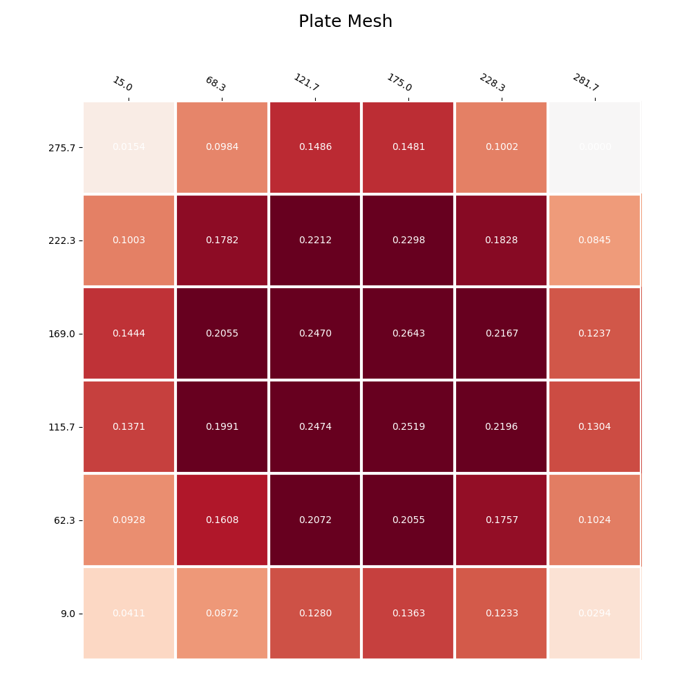
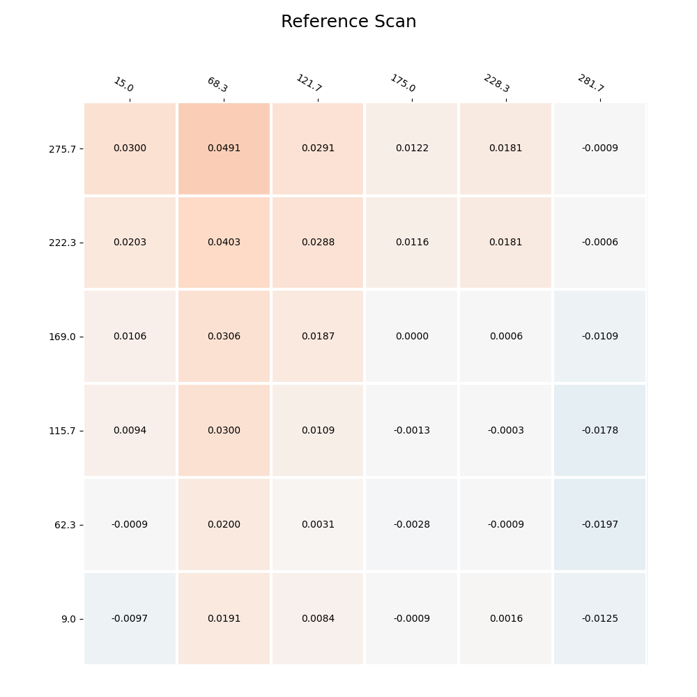
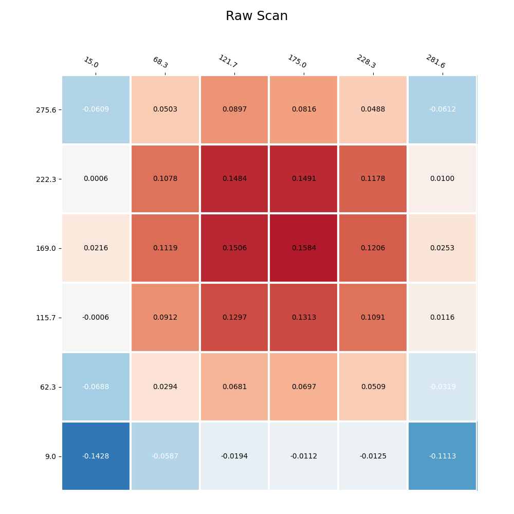

# Plate Scan Results

Plate scan results for plate number: **<module 'uuid' from '/usr/lib/python3.9/uuid.py'>**

Plate scan date: **2022/8/3**

Plate variance: **0.2643**

Plate bin: **B**

Probe repeatability: **0.0003**

Reference scan variance: **0.0688**

## Plate scan




## Test setup

When you take a bed mesh in your 3D printer, you are really measuring the
combined effects of the build plate and the motion system. For example, even
if your build plate is perfectly flat, a bowed X axis will make it look as if
the bed is curved! This can make it very difficult to troubleshoot issues,
because you never *really* know if the variance you're seeing is a product of
the build plate itself or coming from somewhere else. 

To help with this, we devised a system to test each build plate against an
A-grade machinist's granite surface plate, giving you a known reference for
your specific build plate.

Plates are scanned using a dedicated flatness tester, essentially a CoreXY
motion system with a dedicated Z probe toolhead sitting on a granite surface
plate. The Z probe uses a mechanical microswitch driven by a leadscrew.

Prior to each scan, the probe is checked for precision using Klipper's
`PROBE_ACCURACY` command.

Then, a reference scan is taken of the surface plate. This reference scan is
used to account for any imperfections in the motion system: the A-grade
surface plate is assumed to be 'true' flat (it is flat across its entire
surface within +/- 0.002 mm), allowing any observed variation to be
substracted from the plate scan itself.

Next, the aluminum bed is placed on the surface plate on top of a thin piece
of foam, and a scan taken. The foam prevents the plate from rocking during
probing (if, for example, the plate is slightly convex on the bottom), which
could lead to unreliable results at the edges. The deviations from the
reference scan are subtracted from the 'raw' scan to remove the effect of the
motion system.

Finally, the 'delta' scan undergoes digital tramming to yield the final
surface mesh. The 'delta' scan may be tilted slightly due to imperfections in
the thickness of the foam under the plate. Thus, we fit a 2D plane through
the points of the 'delta' mesh and take the residuals, setting the new
minimum point to zero. This effectively 'levels' the bed as you would in a
printer, giving us the best approximation of the true surface profile.

## Test data

### Reference scan




### Raw scan




### Klipper code

You can paste the following code at the end of your `printer.cfg` in klipper
to save your reference mesh in firmware.

***NOTE: DO NOT USE THIS AS A PRINT MESH!*** 

This is *only a reference* for you to load into your Fluidd or Mainsail mesh
visualizer. It does *not* incorporate any deviations from your printer's
motion system, and **can not** be used as a print mesh!


```

#*# [bed_mesh plate_reference]
#*# version = 1
#*# points =
#*# 	0.041078, 0.087188, 0.127969, 0.136267, 0.123315, 0.029409
#*# 	0.092831, 0.160817, 0.207223, 0.205521, 0.175694, 0.102412
#*# 	0.137059, 0.199107, 0.247388, 0.251936, 0.219610, 0.130391
#*# 	0.144438, 0.205548, 0.246954, 0.264315, 0.216676, 0.123707
#*# 	0.100253, 0.178239, 0.221208, 0.229818, 0.182805, 0.084523
#*# 	0.015419, 0.098404, 0.148560, 0.148109, 0.100157, 0.000000

#*# tension = 0.2
#*# min_x = 9.00
#*# algo = bicubic
#*# y_count = 6
#*# mesh_y_pps = 2
#*# min_y = 15.00
#*# x_count = 6
#*# max_y = 281.70
#*# mesh_x_pps = 2
#*# max_x = 275.70

```
